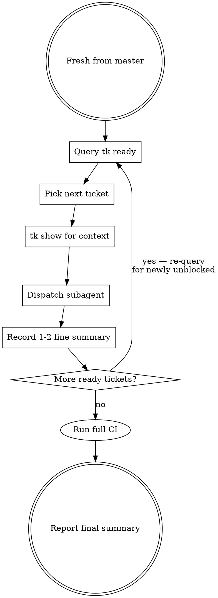

# Ticket Agent Dispatch

Execute tickets with subagents. Sequential by default — one ticket per agent, minimal reporting back. Keeps the parent context window small.

**Core principle:** The parent orchestrates via `tk`; subagents do the work. Only essential outcomes flow back.

## Before Starting — Branch Setup

Ensure you have the latest remote code and a working branch for the epic:

1. `git fetch origin` — pull latest from remote
2. Verify with `git log --oneline origin/master -5` — confirm master is up to date
3. **Create the working branch:**
   ```bash
   git checkout -B <branch-name> origin/master
   ```
4. **Record the branch on the epic ticket:**
   ```bash
   tk add-note <epic-id> "branch: <branch-name>"
   ```

## VCS: Sequential Stacking (Critical)

Agents stack commits sequentially on the working branch. Each agent commits, and the next agent inherits all previous work.

```
origin/master → agent1 commits → agent2 commits → ...
```

- **Sequential**: Agents stack automatically via `git commit`. No extra VCS commands needed between agents.
- **Parallel**: Agents work in the same worktree. Coordinate to avoid editing the same files.

## The Loop



## Testing Strategy

- **Subagents**: Run only the minimum tests needed to validate their change (check CLAUDE.md for project-specific commands)
- **Parent (after all issues done)**: Run full CI and fix any integration issues

## Sequential (Default)

- Re-query `tk ready` each iteration — newly unblocked tickets surface naturally
- Pass only 1-2 sentence summaries between tasks
- Parent never reads files or explores code inline — if it takes more than a glance, delegate

## Parallel Mode

Use only when explicitly requested or when tickets are clearly independent:

1. Each agent runs `/tk:start <id>` — claims ticket
2. Dispatch via `superpowers:dispatching-parallel-agents` pattern
3. Each agent follows `/tk:start` teardown when done (close ticket, sync Jira)

## Subagent Prompt Template

```
Start by running /tk:start <id>

This claims the ticket, looks up the parent epic's notes for worktree info, and cds to the worktree.

[If relevant: "Previous ticket accomplished: <1-2 sentences>"]

Constraints:
- [Scope boundaries]
- [What NOT to change]

VCS:
- Use `git add <files> && git commit -m "message"` when done — do NOT switch branches
- The parent agent manages branching and pushing

Testing:
- Run only the minimum tests needed to validate YOUR change — not the full CI suite
- The parent agent will run full CI after all issues are done

When done:
1. Follow the "After Work is Done" section from /tk:start (close ticket, sync Jira)
2. Do NOT add ticket IDs to commit messages
3. Return ONLY a 1-2 sentence summary of what you did and any key values/paths the next task might need
```

## Common Mistakes

| Mistake | Fix |
|---------|-----|
| Switching branches mid-work | **Never.** Stack via `git commit` on the working branch — next agent inherits automatically |
| Parent reads full subagent output | Ask for "1-2 sentence summary" in every prompt |
| Parent explores code inline | Delegate to subagent |
| Subagent skips teardown | Prompt must say "follow /tk:start teardown" — covers close, Jira sync |
| Re-query skipped after completion | Always `tk ready` again — deps may have unblocked |
| Parallel without `/tk:start` | Two agents grab same ticket — `/tk:start` claims it |
