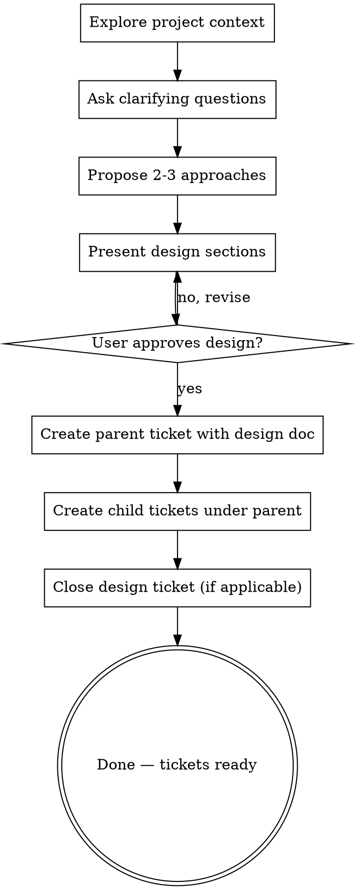

# Brainstorming Ideas Into Designs

Help turn ideas into fully formed designs and specs through natural collaborative dialogue.

Start by understanding the current project context, then ask questions one at a time to refine the idea. Once you understand what you're building, present the design and get user approval. The end result is a parent ticket with the full design document and child tickets for each task.

<HARD-GATE>
Do NOT invoke any implementation skill, write or scaffold source code, or take any implementation action on code. The terminal state is a set of tickets. Exception: if the user explicitly asks you to write or edit a documentation file (e.g., "write a doc", "save this to a file", "create a CLAUDE.md"), you may do so — writing a doc the user asked for is not transitioning to implementation.
</HARD-GATE>

## Anti-Pattern: "This Is Too Simple To Need A Design"

Every project goes through this process. A todo list, a single-function utility, a config change — all of them. "Simple" projects are where unexamined assumptions cause the most wasted work. The design can be short (a few sentences for truly simple projects), but you MUST present it and get approval.

## Anti-Pattern: "Let Me Start Coding"

This skill does NOT transition to implementation. There is no "next step" after tickets are created. The user will decide when and how to implement. Do not suggest coding, do not invoke writing-plans, do not mention implementation skills. Writing a documentation file the user explicitly requested (e.g., "write a doc", "save this to a file") is not transitioning to implementation — it is a direct response to a user verb. Generic questions about design still produce chat answers, not unsolicited files.

## Design Ticket

The design skill MAY be invoked on a **design ticket** — a ticket of type `design` that triggered this design session. You can identify the design ticket from the current ticket context (e.g., `$TICKET_ID` or the ticket the user is working on).

**This lifecycle flow ONLY applies when the current ticket is a design ticket.** If the skill is invoked without a design ticket (e.g., the user just wants to brainstorm), skip the design ticket lifecycle steps (closing, etc.) and just create the epic and child tickets normally.

When a design ticket is present:
- Create a NEW parent ticket for the implementation: `ur ticket create "Title" --body "..." --output json`
- Create all child tickets parented to the NEW parent ticket
- Close the design ticket: `ur ticket update <design-ticket-id> --status closed --output json`

## Checklist

You MUST create a task for each of these items and complete them in order:

1. **Explore project context** — read the ticket with `ur ticket show <id> --output json`, then find related tickets with `ur ticket list --tree <ticket-id> --output json`. Read relevant CLAUDE.md files, agents.md files, and codeflows. Do NOT bulk-fetch unrelated ticket lists or other large datasets.
2. **Ask clarifying questions** — one at a time, understand purpose/constraints/success criteria
3. **Propose 2-3 approaches** — with trade-offs and your recommendation
4. **Present design** — in sections scaled to their complexity, get user approval after each section
5. **Create parent ticket** — create a new parent ticket with the full design document as the body
6. **Create child tickets** — one per discrete task, all parented to the parent ticket
7. **Close the design ticket** (only if invoked on a design ticket) — design is complete, close it

## Process Flow



**The terminal state is "Done — tickets ready."** Do NOT invoke writing-plans, frontend-design, mcp-builder, or any other skill. Do NOT suggest coding or implementation as a next step.

## The Process

**Understanding the idea:**

- Read the ticket being designed with `ur ticket show <id> --output json`. Then find related tickets with `ur ticket list --tree <ticket-id> --output json` to understand the ticket's place in the hierarchy (parent, siblings, children). Read relevant CLAUDE.md files and agents.md files — they contain crate-specific conventions, constraints, and architectural decisions that should inform the design. Check relevant codeflows if the work touches cross-cutting concerns. Do NOT bulk-fetch unrelated ticket lists, dump large datasets, or speculatively gather "project context" — if you need a specific ticket, fetch that ticket.
- Before asking detailed questions, assess scope: if the request describes multiple independent subsystems (e.g., "build a platform with chat, file storage, billing, and analytics"), flag this immediately. Don't spend questions refining details of a project that needs to be decomposed first.
- If the project is too large for a single spec, help the user decompose into sub-projects: what are the independent pieces, how do they relate, what order should they be built? Then brainstorm the first sub-project through the normal design flow. Each sub-project gets its own parent ticket.
- For appropriately-scoped projects, ask questions one at a time to refine the idea
- Prefer multiple choice questions when possible, but open-ended is fine too
- Only one question per message - if a topic needs more exploration, break it into multiple questions
- Focus on understanding: purpose, constraints, success criteria

**Exploring approaches:**

- Propose 2-3 different approaches with trade-offs
- Present options conversationally with your recommendation and reasoning
- Lead with your recommended option and explain why

**Presenting the design:**

- Once you believe you understand what you're building, present the design
- Scale each section to its complexity: a few sentences if straightforward, up to 200-300 words if nuanced
- Ask after each section whether it looks right so far
- Cover: architecture, components, data flow, error handling, testing
- Be ready to go back and clarify if something doesn't make sense

**Design for isolation and clarity:**

- Break the system into smaller units that each have one clear purpose, communicate through well-defined interfaces, and can be understood and tested independently
- For each unit, you should be able to answer: what does it do, how do you use it, and what does it depend on?
- Can someone understand what a unit does without reading its internals? Can you change the internals without breaking consumers? If not, the boundaries need work.
- Smaller, well-bounded units are also easier for you to work with - you reason better about code you can hold in context at once, and your edits are more reliable when files are focused. When a file grows large, that's often a signal that it's doing too much.

**Working in existing codebases:**

- Explore the current structure before proposing changes. Follow existing patterns.
- Where existing code has problems that affect the work (e.g., a file that's grown too large, unclear boundaries, tangled responsibilities), include targeted improvements as part of the design - the way a good developer improves code they're working in.
- Don't propose unrelated refactoring. Stay focused on what serves the current goal.

## After the Design

**Creating the parent ticket:**

- Create a new parent ticket with the full design document as the body: `ur ticket create "Title" --body "..." --output json`
- The design document should include architecture, components, data flow, error handling, testing strategy, and all decisions made during brainstorming
- If invoked on a design ticket, add a link between the design ticket and the new parent: `ur ticket add-link <design-ticket-id> <parent-id> --output json`
- Register the parent ticket with workerd so `/dispatch` knows which ticket to use: `workertools workflow set-ticket <parent-id>`

**Creating child tickets:**

- Create one ticket per discrete, implementable task using `ur ticket create "Task title" --parent <parent-id> --output json`
- Do NOT use the `--wip` flag — child tickets must default to lifecycle_status=open so they are immediately dispatchable
- Each ticket body MUST follow this format:
  ```
  ## Description
  What to build and why.

  ## Context
  How this component interacts with its neighbors — inputs, outputs, shared interfaces.

  ## Files
  - path/to/file.rs (create/modify)
  - path/to/other.rs (modify)

  ## Acceptance Criteria
  - [ ] Concrete conditions for done
  ```
- Order tickets by dependency — use `ur ticket add-block <id> <dep-id> --output json` for hard dependencies
- Use `ur ticket add-link <id> <id> --output json` for related but non-blocking relationships
- Tickets should be small enough for a single agent to complete in one session

**Closing the design ticket:**

- This step ONLY applies if the design skill was invoked on a design ticket
- Once all child tickets are created, close the design ticket: `ur ticket update <design-ticket-id> --status closed --output json`
- This signals that the design phase is complete and has been broken down into actionable work

**That's it. You're done.** Do not suggest next steps. Do not mention coding. Do not invoke any other skill. The user has a complete set of tickets and will decide what to do with them.

## Key Principles

- **One question at a time** - Don't overwhelm with multiple questions
- **Multiple choice preferred** - Easier to answer than open-ended when possible
- **YAGNI ruthlessly** - Remove unnecessary features from all designs
- **Explore alternatives** - Always propose 2-3 approaches before settling
- **Incremental validation** - Present design, get approval before moving on
- **Be flexible** - Go back and clarify when something doesn't make sense
- **No code** - This skill produces tickets, not code
