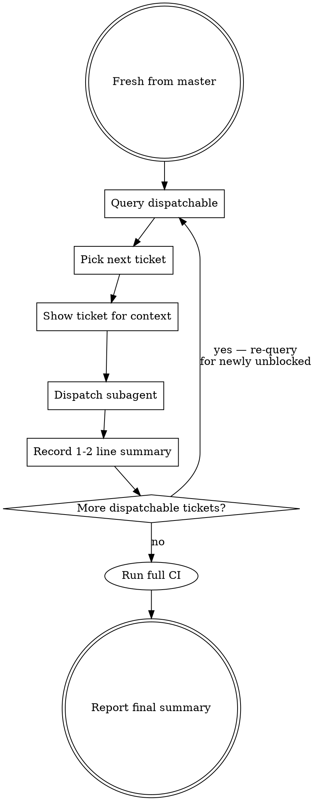

# Implement Tickets

Implement one or more tickets. For a **single ticket**, work on it directly. For an **epic or multiple tickets**, dispatch subagents — one per ticket, sequential by default.

## Single Ticket

When given a single non-epic ticket:

1. `ur ticket --output json show <id>` — read the ticket
2. `ur ticket --output json update <id> --status in_progress` — claim it
@/home/worker/.claude/skill-hooks/implement/after-ticket-claim.md
3. Implement the work directly in this context
@/home/worker/.claude/skill-hooks/implement/before-commit.md
@/home/worker/.claude/skill-hooks/implement/before-ticket-close.md
4. Commit, close: `ur ticket --output json update <id> --status closed`

No subagents needed. Just do the work.

## Epic or Multiple Tickets — Subagent Dispatch

**Core principle:** The parent orchestrates via `ur ticket`; subagents do the work. Only essential outcomes flow back.

### Before Starting — Branch Setup

1. `git fetch origin` — pull latest from remote
2. `git checkout -B <branch-name> origin/master`
3. Record the branch on the epic: `ur ticket --output json add-activity <epic-id> "branch: <branch-name>"`

### VCS: Sequential Stacking (Critical)

Agents stack commits sequentially on the working branch. Each agent commits, and the next agent inherits all previous work.

```
origin/master -> agent1 commits -> agent2 commits -> ...
```

### The Loop



### Sequential (Default)

- Re-query `ur ticket --output json dispatchable <epic-id>` each iteration — newly unblocked tickets surface naturally
- Pass only 1-2 sentence summaries between tasks
- Parent never reads files or explores code inline — if it takes more than a glance, delegate

### Parallel Mode

Use only when explicitly requested or when tickets are clearly independent:

1. Each subagent claims its ticket: `ur ticket --output json update <id> --status in_progress`
2. Dispatch via `superpowers:dispatching-parallel-agents` pattern
3. Each subagent closes its ticket when done

### Testing Strategy

- **Subagents**: Run only the minimum tests needed to validate their change (check CLAUDE.md for project-specific commands)
- **Parent (after all issues done)**: Run full CI and fix any integration issues

@/home/worker/.claude/skill-hooks/implement/before-dispatch.md

### Subagent Prompt Template

```
Implement ticket <id>.

`ur ticket --output json show <id>` to read the full ticket.

Claim: `ur ticket --output json update <id> --status in_progress`

[If relevant: "Previous ticket accomplished: <1-2 sentences>"]

Constraints:
- [Scope boundaries]
- [What NOT to change]

VCS:
- Use `git add <files> && git commit -m "message"` when done — do NOT switch branches
- The parent agent manages branching and pushing

Testing:
- Run only the minimum tests needed to validate YOUR change — not the full CI suite
- The parent agent will run full CI after all issues are done

@/home/worker/.claude/skill-hooks/implement/before-commit.md
@/home/worker/.claude/skill-hooks/implement/before-ticket-close.md

When done:
1. Close the ticket: `ur ticket --output json update <id> --status closed`
2. Do NOT add ticket IDs to commit messages
3. Return ONLY a 1-2 sentence summary of what you did and any key values/paths the next task might need
```

### Common Mistakes

| Mistake | Fix |
|---------|-----|
| Switching branches mid-work | **Never.** Stack via `git commit` on the working branch — next agent inherits automatically |
| Parent reads full subagent output | Ask for "1-2 sentence summary" in every prompt |
| Parent explores code inline | Delegate to subagent |
| Re-query skipped after completion | Always `ur ticket --output json dispatchable <epic>` again — deps may have unblocked |
| Parallel without claiming | Two agents grab same ticket — always claim first |

$ARGUMENTS
